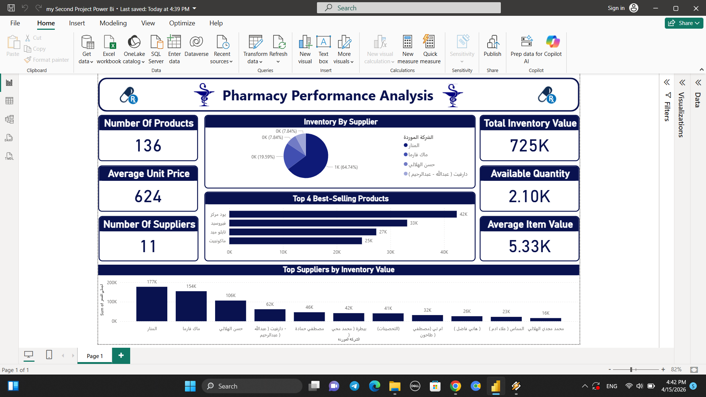

# 💊 Pharmacy Sales & Performance Analysis Dashboard

## 📌 Project Overview
This project is a comprehensive data analysis case study focused on a pharmacy’s sales performance across products, categories, customers, and time periods.

The goal of this project was not just to build a dashboard, but to deeply analyze business performance, identify demand patterns, detect inefficiencies, and provide actionable insights that can improve revenue, inventory management, and overall operational efficiency.

This project simulates a real-world business intelligence scenario where raw pharmacy sales data is transformed into meaningful insights that support strategic decision-making.

---

## ❗ Business Problem

Before this analysis, the pharmacy faced several challenges:

- Lack of clear visibility into best-selling and slow-moving medicines  
- Difficulty in tracking revenue performance over time  
- No proper understanding of customer purchasing behavior  
- Inefficient inventory management leading to overstock and shortages  
- Limited insight into profitability by product category  
- No structured analysis of seasonal demand patterns  

These issues affected sales efficiency, stock management, and overall profitability.

---

## 🛠️ My Role & What I Did

In this project, I acted as a Data Analyst responsible for transforming raw pharmacy data into actionable business intelligence.

### 🔹 Data Preparation
- Cleaned and structured raw pharmacy sales data  
- Handled missing values and inconsistencies  
- Standardized product categories and sales records  

### 🔹 Data Analysis
- Performed exploratory data analysis (EDA)  
- Identified best-selling and low-performing products  
- Analyzed revenue trends over time  
- Studied customer purchasing patterns  
- Evaluated inventory movement and demand cycles  

### 🔹 Dashboard Development
- Built an interactive pharmacy sales dashboard  
- Designed KPIs for performance tracking  
- Created insights for products, revenue, and time trends  
- Ensured clear visualization for decision-makers  

---

## 📊 Key Performance Indicators (KPIs)

1. Total Revenue  
2. Total Units Sold  
3. Total Orders  
4. Average Order Value  
5. Total Profit  
6. Product Performance Analysis  
7. Product Category Performance  
8. Inventory Turnover Rate  
9. Sales by Product  
10. Sales by Category  
11. Sales by Month  
12. Revenue by Customer Type  
13. Revenue Performance Over Time  

---

## 📈 Business Insights & Findings

### 🔴 Key Problems Identified
- Some medicines were overstocked but had low demand  
- High-demand products occasionally faced stock shortages  
- Seasonal trends strongly affected sales performance  
- Profit margins varied significantly across product categories  
- Certain products contributed most of the revenue  

### 🟢 Opportunities Discovered
- Better inventory planning can reduce stock waste  
- Focus on high-demand medicines can increase revenue  
- Seasonal forecasting can improve stock availability  
- Optimizing product mix can improve profitability  
- Customer-based targeting can improve sales efficiency  

---

## 🚀 Business Impact

This analysis provided the pharmacy with:

- 📊 Clear visibility into sales and product performance  
- 💡 Data-driven understanding of demand patterns  
- 📉 Reduction in inventory inefficiencies and stock issues  
- 📈 Improved product selection and sales focus  
- 🎯 Better decision-making in purchasing and stock management  

### 💰 Expected Impact on Business:
- Increased revenue through optimized product availability  
- Reduced losses from expired or unsold stock  
- Improved profit margins through better product focus  
- More efficient inventory management  
- Stronger demand forecasting capability  

---

## 🛠️ Tools & Technologies Used
- Power BI / Tableau  
- Microsoft Excel  
- Data Cleaning & Transformation  
- Data Visualization & Business Intelligence  

---

## 📊 Dashboard Preview

### 🔹 Pharmacy Dashboard

---

## 🎯 Final Conclusion

This project demonstrates how pharmacy sales data can be transformed into actionable business intelligence that directly improves operational and financial performance.

By analyzing sales, products, and customer behavior, this project uncovers key insights that help optimize inventory, increase revenue, and improve overall decision-making.

---

## 🔥 Key Takeaway
Data transforms pharmacy operations from guesswork into precision-driven decision making.
